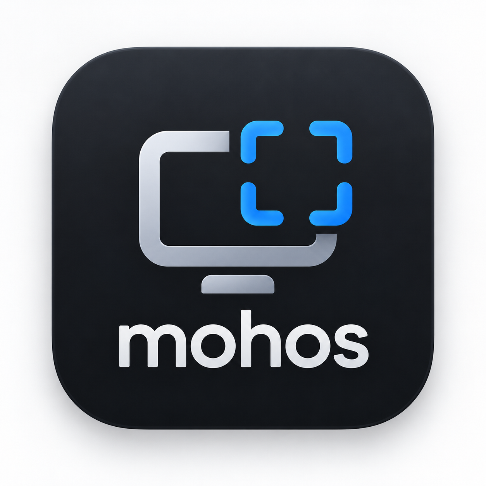

# mohos

<p align="center">
  
  <h3 align="center">mohos</h3>
  <p align="center">
    A lightweight, native macOS menu bar utility for instant display resolution management and zero-file clipboard screenshot workflows.
    <br />
    Created & Developed by <b>Mohamed Moho</b>
  </p>
  <p align="center">
    <a href="LICENSE"></a>
    
    
    
  </p>
</p>

---

## ✨ Features & Superpowers

### 1. 📸 Clipboard-First Screenshot Workflow (`⌘⇧4` → Clipboard)
Designed specifically for modern AI workflows (ChatGPT, Claude, Gemini, Cursor) where you need to quickly clip an area of your screen and paste it into chat **without clogging your Desktop with temporary screenshot files**:
- **Intercepts `⌘⇧4` globally**: Automatically translates `⌘` + `⇧` + `4` to `⌃` + `⌘` + `⇧` + `4` via Quartz `CGEventTap`.
- **Zero File Creation**: Opens Apple's native area-selection tool and copies the image directly to your clipboard — **no PNG files written to disk**.
- **No Karabiner-Elements Required**: Operates natively in-memory without Karabiner rules or background shell scripts.
- **Recursion Guard**: Uses custom event source tagging (`0x5343524E`) to prevent infinite event loop recursion.

### 2. 🖥 Instant Display Resolution Switching
- **HiDPI (Retina) & LoDPI Modes**: Switch between Retina scaling modes and native unscaled display resolutions instantly.
- **macOS Sonoma/Sequoia Control Center Capsule Slider**: Includes a sleek `44pt` Control Center capsule slider with live active resolution feedback and SF Symbols.
- **1-Click Segmented Controls**: Quickly filter `[ All | HiDPI | LoDPI ]` and toggle between `[ List | Slider ]` views.
- **Dynamic Screen Detection**: Automatically updates when external monitors are plugged in or disconnected (`didChangeScreenParametersNotification`).

### 3. ⚡ Ultra-Lightweight & Native
- **Zero Idle CPU Footprint**: Built with pure Swift and AppKit. Event tap sleeps naturally with 0.0% CPU overhead when idle.
- **No Electron**: No web views, no heavy Node runtime, no memory bloat.

---

## 🖥 Prerequisites

**mohos** uses [`displayplacer`](https://github.com/jresh/displayplacer) as its native display engine. Install it via Homebrew:

```bash
brew install displayplacer
```

---

## 🛠 Building & Installing

Clone the repository and run the automated build script:

```bash
git clone https://github.com/mohomohamed/mohos.git
cd mohos
chmod +x build.sh
./build.sh
```

The script compiles the Swift source modules, signs the bundle ad-hoc, installs `mohos.app` to `~/Applications/mohos.app`, and launches it immediately.

---

## 🔐 Permissions

The **Clipboard Screenshot Workflow** (`⌘⇧4`) requires macOS **Accessibility Permission** (`AXIsProcessTrusted`).
- If permission is required when the feature is enabled, a subtle `[Grant Permission]` button appears directly inside the menu view to open **System Settings → Privacy & Security → Accessibility**.
- **mohos** automatically detects when permission becomes granted upon returning to the app without annoying popups.

---

## 📁 Architecture & Code Structure

```
mohos/
├── src/
│   ├── Models.swift                  # DisplayInfo, DisplayMode, ViewMode, DisplayFilterMode
│   ├── PreferencesManager.swift      # UserDefaults persistence wrapper
│   ├── DisplayManager.swift          # displayplacer integration & resolution switching
│   ├── PermissionManager.swift       # Accessibility permission & System Settings launcher
│   ├── ScreenshotShortcutManager.swift # Quartz CGEventTap ⌘⇧4 shortcut translator
│   ├── LoginItemManager.swift        # SMAppService (macOS 13+) & LaunchAgent login manager
│   ├── Views/
│   │   ├── DisplayHeaderView.swift   # Monitor icon, display name, resolution & active badge
│   │   ├── ControlCenterSliderView.swift # Sonoma/Sequoia Control Center capsule slider
│   │   ├── ScreenshotWorkflowView.swift  # ⌘⇧4 → Clipboard toggle & permission row
│   │   └── SegmentedControlViews.swift   # Mode filter & List/Slider view segmented controls
│   ├── AppDelegate.swift             # Application delegate & status menu controller
│   └── main.swift                    # Application entry point
├── Info.plist                        # App bundle metadata
├── AppIcon.icns                      # macOS App Icon
├── build.sh                          # Build & installation script
├── LICENSE                           # MIT License
└── README.md                         # Documentation
```

---

## 👤 Author

Developed by **Mohamed Moho** ([@mohomohamed](https://github.com/mohomohamed)).

---

## 📄 License

This project is licensed under the [MIT License](LICENSE).
